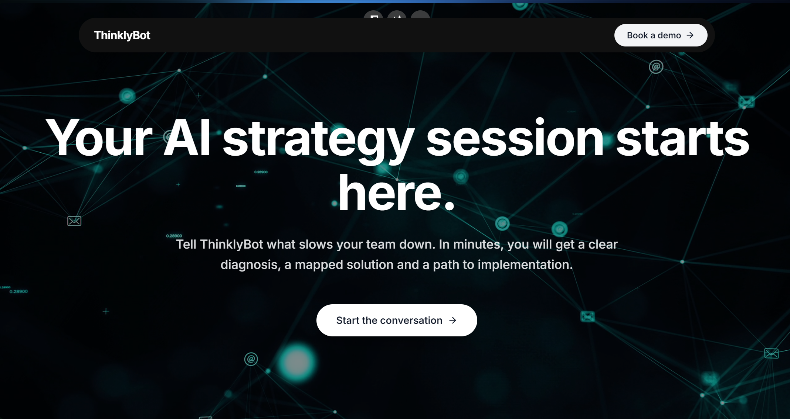
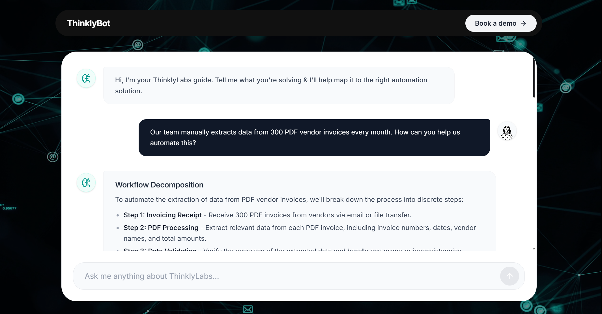

# ThinklyBot 

ThinklyBot is an advanced AI chat application built with Next.js. It features a sleek, dark glassmorphism user interface with smooth transitions, providing a seamless conversational experience. Beyond standard text generation, ThinklyBot excels at rendering dynamic UI components like LaTeX mathematical formulas inline.

##  UI Screenshot






##  What It Does

- **Intelligent Conversations:** Engages in contextual and coherent interactions using state-of-the-art AI models.
- **LaTeX Formatting:** Renders mathematical formulas and equations perfectly.
- **Sleek UI/UX:** Features a vibrant dark glassmorphism design with atmospheric background orbs and fluid transitions.
- **Streaming Responses:** Real-time text generation leveraging Vercel AI SDK for an ultra-fast user experience.


## 🛠️ Tech Stack

- **Framework:** Next.js 16 (App Router)
- **Language:** TypeScript
- **Styling:** Tailwind CSS v4, Lucide React (Icons)
- **AI Integration:** Vercel AI SDK (`ai`), supporting models via Groq, OpenAI, and GitHub Models.
- **Database & Auth:** Supabase
- **Rendering:** `react-markdown` and `remark-gfm` for rich text.

##  Getting Started

First, install the dependencies:

```bash
npm install
# or
yarn install
# or
pnpm install
```

Set up your `.env.local` file with your API keys (Groq, OpenAI, Supabase, etc.).

Then, run the development server:

```bash
npm run dev
# or
yarn dev
# or
pnpm dev
```

Open [http://localhost:3000](http://localhost:3000) with your browser to see the result.
